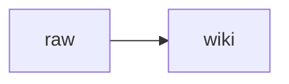

# CLAUDE.md — LLM-maintained wiki (segundo-cerebro)

This repository is a **Karpathy-style “LLM Knowledge Base”**: curated **immutable** sources under `raw/`, a compounding **Markdown (+ Mermaid) wiki** under `wiki/`, and this file as the **schema** the agent must follow.

**Domain:** studying **data science** and **AI engineering** from articles and videos (and related notes).

---

## Architecture (3 layers)

1. **`raw/`** — source-of-truth documents **added by the human**. Agents **read only**. Never edit, rename, move, or delete files under `raw/` (including `raw/assets/`).
2. **`wiki/`** — LLM-owned Markdown. The human reads; the agent creates/updates pages, links, indexes, and logs.
3. **`CLAUDE.md`** (this file) — conventions + workflows. Co-evolve with the human over time.

Optional: **`tools/`** — tiny stdlib helpers (e.g. `wiki_search.py`).

---

## Language convention (bilingual)

- **Body text:** Brazilian Portuguese (**pt-BR**) for explanations, synthesis, and study notes.
- **English** for: YAML **keys**, **slugs**, **folder names**, common field terms (*embedding*, *fine-tuning*, *RAG*, *KV-cache*, …), and **verbatim quotes** from English sources.
- **Titles:** prefer pt-BR; keep paper titles / proper nouns as-is.
- On substantive wiki pages, add a short **“Termos (EN)”** gloss when jargon is dense.

---

## Wiki layout

| Path | Purpose |
|------|---------|
| `wiki/sources/` | One page per ingested source (summary + pointers to raw path) |
| `wiki/concepts/` | Concept pages (definitions, links, tensions) |
| `wiki/entities/` | People, orgs, models, datasets — when useful |
| `wiki/explorations/` | Filed answers / analyses the human wants kept |
| `wiki/overview.md` | Living synthesis (“what we believe so far”) |
| `wiki/index.md` | Content catalog (must be updated after ingests / major queries) |
| `wiki/log.md` | Append-only timeline |

---

## Internal linking (Obsidian-style)

- Use wikilinks: `[[page title]]` or `[[folder/page title]]` **without** `.md` extensions.
- Prefer **stable note titles** matching the `title` frontmatter field.
- Every new page should link **up** to concepts and **sideways** to related pages.
- After adding a source page, update relevant concept pages and `wiki/overview.md` if needed.

---

## Frontmatter (required on new wiki pages)

Not required on `wiki/index.md` / `wiki/log.md` unless helpful.

```yaml
---
title: "<pt-BR title>"
slug: "<ascii-kebab-case>"
type: source|concept|entity|exploration|overview
lang: pt-BR
sources:
  - "[[...]]"   # wikilinks to source pages and/or notes like `raw/...` in backticks if needed
updated: YYYY-MM-DD
tags: [data-science, ai-engineering]
summary: "<one line, pt-BR>"
---
```

- `slug` should match the filename stem when practical (`slug: foo` → `foo.md`).
- `sources` lists evidence backing the page.

---

## Output formats (MVP)

- **Markdown** and **Mermaid** diagrams only inside `wiki/`.
- Do **not** add Marp, matplotlib pipelines, or mandatory web-search tooling unless the human asks.

---

## Workflow: Ingest (one source at a time)

**Never** ingest multiple brand-new sources in one pass unless the human explicitly requests batching.

### Steps

1. **Locate** the new source the human points to (typically a single file under `raw/`).
2. **Read** it (if images exist, follow up by reading key images separately when needed).
3. **Propose** to the human: key takeaways, proposed wiki changes (list of pages to create/update), and open questions / uncertainties.
4. **Wait** for human confirmation on emphasis and scope.
5. **Write** the wiki updates (often 5–15 files):  
   - `wiki/sources/<slug>.md`  
   - update/create `wiki/concepts/*` as needed  
   - update/create `wiki/entities/*` if useful  
   - update `wiki/overview.md`  
   - update backlinks across touched pages  
   - update `wiki/index.md`  
   - append `wiki/log.md` with `## [YYYY-MM-DD] ingest | <short title>`

### Log entry template

```markdown
## [2026-04-21] ingest | <short title>

- Raw: `raw/...`
- Wiki pages touched: ...
- Open questions: ...
```

---

## Workflow: Query / Q&A

1. Use `wiki/index.md` first to find relevant pages; drill into linked notes.
2. Answer with **citations** to wiki pages (`[[...]]`) and raw paths (`` `raw/...` ``) when appropriate.
3. If the human wants an answer preserved, create/update a page under `wiki/explorations/` and link it from `wiki/index.md`, then append `wiki/log.md` (`query`).

---

## Workflow: Lint (on-demand only)

Run only when the human asks.

### Checklist

- Contradictions between pages; mark uncertainty or resolve with evidence.
- Stale claims vs newer sources (flag + propose update).
- Orphan pages (no inbound wikilinks).
- Recurring terms missing concept pages.
- Missing cross-links between related notes.
- Broken wikilinks (best-effort detection).
- Duplicate coverage (merge plan).
- Suggest **next questions** and **next sources** to ingest.

Append `wiki/log.md`: `## [YYYY-MM-DD] lint | <one-line summary>` plus bullet findings.

---

## Mermaid

Use fenced blocks:

````markdown

````

---

## Tooling: local wiki search

From repo root:

```bash
python tools/wiki_search.py "<query>"
```

Useful when the wiki grows beyond trivial size. Still keep `wiki/index.md` healthy.

---

## Privacy / safety

Assume **no highly sensitive personal data** in this vault. Do not invent private facts about real people. Never commit secrets or credentials.

---

## Git

Commit wiki changes in coherent chunks with clear messages. Do not commit large binaries unless the human explicitly wants them versioned.

---

## First action for a new session

If the human says “ingest”, identify **exactly one** new raw file, then follow the ingest workflow. If unclear which file, ask.
