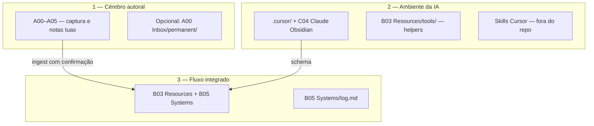

# Operação da IA no cofre

Referência humana (Obsidian) alinhada ao vídeo da Ana Jords sobre [segundo cérebro com Obsidian e IA](https://youtu.be/8NOxb2WV95I): a IA como **bibliotecária e multiplicadora**, não autora do seu raciocínio; notas permanentes e estudo **feitos por você**.

## Os três fluxos

## Esquema de pastas da Ana no Obsidian (A / B / C)

No vídeo, o cofre aparece organizado por **prefixo + número** (`A00`, `B01`…) para fixar a ordem no explorador e **cores** por grupo (três famílias). Em vaults grandes isso separa bem **entrada**, **PARA / sistemas** e **integrações / IA**.

| Grupo | Pastas no exemplo (Ana) | Função | Equivalente neste repo (`segundo-cerebro`) |
|-------|-------------------------|--------|---------------------------------------------|
| **A** — entrada e rotina | `A00 Inbox`, `A01 Processamento`, `A02 Anchor Topics`, `A03 Banco de imagens`, `A04 Daily Notes`, `A05 Backlog` | Captura bruta → triagem → temas âncora; imagens; diário; fila | **`A00 Inbox/clippings/`** ≈ inbox/capturas para ingest; **`A03 Banco de imagens/`** ≈ imagens; âncoras/daily/backlog costumam ficar **no resto do teu vault Obsidian** (fora deste Git), ou em `A00 Inbox/permanent/` se quiseres versionar notas tuas aqui |
| **B** — PARA + sistemas | `B01 Projects`, `B03 Resources`, `B04 Archives`, `B05 Systems` | Projetos com fim, recursos de referência, arquivo, **processos explícitos** | **`B01 Projects/explorations/`** + perguntas em [[B05 Systems/overview|overview]] ≈ projetos/threads ativos; **`B03 Resources/concepts/`** + **`B03 Resources/sources/`** ≈ recursos; histórico em **`B05 Systems/log.md`** + fontes antigas ≈ arquivo; **`B05 Systems/meta/`** + `.cursor/CLAUDE.md` ≈ *systems* (como o cofre funciona) |
| **C** — integrações e IA | `C02 Readwise`, `C03 Books database`, **`C04 Claude Obsidian`**, `C05 Excalidraw` | Dados de ferramentas; **pasta dedicada à IA** (docs, ponteiros); desenhos | Readwise/livros → novas fontes em **`A00 Inbox`** quando quiseres ingerir; **`C04`** ≈ README + links; **schema** em **`.cursor/`**; **conteúdo gerido pelo agente** em **`B03`/`B05`/`B01`** + **`B05 Systems/log.md`**; diagramas: Mermaid na wiki ou Excalidraw em **`C05`** / exports em **`A03 Banco de imagens/`** |

**Resumo:** o **Grupo C** espelha integrações; a “zona autónoma” de escrita do agente é **`B*`** (não **`A*`** nem **`C02`/`C03`/`C05`**). **`C04`** pode ser só teu quadro de avisos; o agente não reescreve as tuas capturas.

## PARA + Zettelkasten (como encaixa aqui)

| PARA | Onde neste repositório |
|------|-------------------------|
| **Projetos** | Metas ativas: muitas vezes refletidas em perguntas em [[B05 Systems/overview|overview]] ou análises em `B01 Projects/explorations/` |
| **Áreas** | Responsabilidades contínuas (ex.: “estudar DS/IA”): guia [[B05 Systems/overview|overview]] + conceitos que você mantém vivos |
| **Recursos** | `B03 Resources/concepts/` + fontes catalogadas em `B03 Resources/sources/` |
| **Arquivo** | Fontes antigas ainda úteis + entradas antigas em `B05 Systems/log.md`; revisão humana decide o que permanece no índice |

*Zettelkasten* no sentido forte (notas atômicas **suas**): use `A00 Inbox/permanent/` se criar essa pasta — só você edita; a IA não mexe em **`A*`** / **`C02`/`C03`/`C05`**.

## Papéis e responsabilidades

| Atividade | Você | Agente |
|-----------|------|--------|
| Colocar clipings, PDFs, transcrições em `A00 Inbox/` (ex.: `clippings/`) | Sim | Não (imutável) |
| Escrever notas permanentes / atomização autoral | Sim | Não substituir seu juízo |
| Pedir ingest e **aprovar** takeaways | Sim | Propõe; só grava **`B03`/`B05`/`B01`** após confirmação |
| Manter `B05 Systems/index.md`, links, conceitos | Delegável | Sim, dentro do workflow |
| Alterar `CLAUDE.md` / regras do cofre | Decisão sua | Só quando você pedir |
| Lint, consistência, links quebrados | Pedir quando quiser | Sim, sob demanda |
| Evitar “depósito de lixo” na wiki | Revisar overview e índice periodicamente | Pode sinalizar em lint |

## O que pode mudar sem pedir permissão (agente)

- Arquivos em **`B01 Projects/`**, **`B03 Resources/`**, **`B05 Systems/`** (e **`B04 Archives/`** quando fizer sentido no workflow) conforme ingest confirmado, queries arquivadas e lint pedido.
- **`B05 Systems/log.md`** — append conforme workflow.

## O que exige sua mão ou pedido explícito

- Qualquer alteração em **`A*`** ou em **`C02`/`C03`/`C05`** (zonas human-only).
- Mudanças de **governança** em `.cursor/CLAUDE.md` e `.cursor/rules/` — alinhar com você antes, salvo você pedir “atualiza o schema”.
- **Ingest em lote** — só se você pedir explicitamente.

## Mensagem do fim do vídeo (lembrança)

Quando memória de contexto for commodity, o que permanece valioso são **seus processos**, **critérios** e **notas autorais** — este arquivo ajuda a não misturar isso com o que a IA pode reescrever (**`B03`/`B05`/`B01`**).
